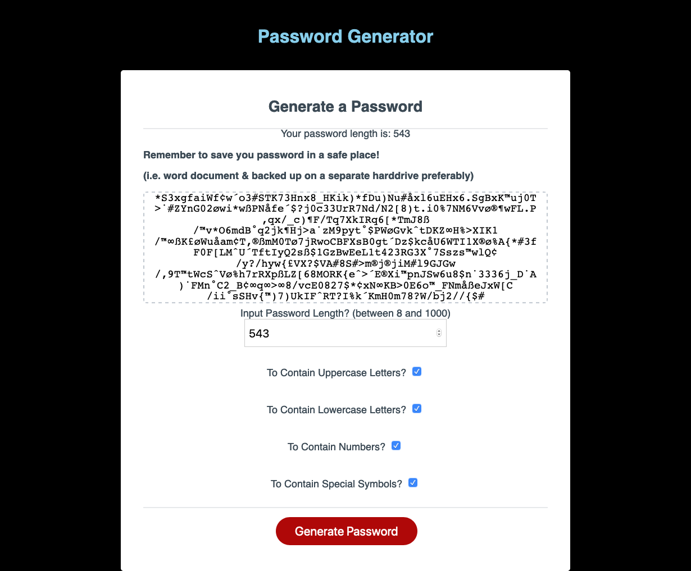

# random-password-generator

## Deployment Link

https://dj-viking.github.io/random-password-generator

## Screenshot

## Summary

1. Enter into the input field how long your password should be between 8 and 1000 characters

2. Check which criteria you would like your password to follow in the displayed checkboxes
  * Upper Case letters?
  * Lower Case letters?
  * Special Characters?
  * Numbers?

3. Click Generate Password to display a text area where the password will appear for you to copy or modify 